# Quiz Portal — Complete Technical Documentation

> **A comprehensive technical reference covering every aspect of the Quiz Portal project.**
> Written for beginners, developers, interviewers, and code reviewers alike.

---

## Table of Contents

1. [Project Explanation](#1-project-explanation)
2. [Architecture](#2-architecture)
3. [Folder Structure](#3-folder-structure)
4. [Execution Flow](#4-execution-flow)
5. [Connection Flow](#5-connection-flow)
6. [Code Deep Dive](#6-code-deep-dive)
7. [Database Explanation](#7-database-explanation)
8. [API Documentation](#8-api-documentation)
9. [Security Explanation](#9-security-explanation)
10. [Deployment Explanation](#10-deployment-explanation)
11. [Interview Preparation](#11-interview-preparation)

---

# 1. Project Explanation

## 1.1 What Is Quiz Portal?

Quiz Portal is a **full-stack web application** that lets users take timed, multiple-choice quizzes and see their scores instantly. Think of it like an online exam platform — teachers (admins) create quizzes, students (users) attempt them, and everyone can review past results.

### In Simple Terms

Imagine you go to a website. You sign in with Google, or create an account with your email. You see a list of quizzes. You click one, a timer starts counting down, and you answer questions. When you finish (or time runs out), the system grades your quiz automatically and shows you exactly which questions you got right and wrong.

## 1.2 Problem It Solves

| Problem | How Quiz Portal Solves It |
|---------|--------------------------|
| Creating and distributing quizzes is tedious (paper, email, Google Forms) | Admins create quizzes through a sleek web form; they're instantly available to all users |
| Grading is manual and error-prone | Automatic client-side scoring the instant a quiz is submitted |
| No time pressure in self-study | Built-in countdown timer with auto-submit |
| Hard to track progress over time | Full attempt history with percentage scores |
| No review of what went wrong | Detailed answer review showing correct vs. selected answers |

## 1.3 Real-World Use Cases

- **Classrooms**: A teacher creates a quiz on JavaScript; students log in and complete it during class.
- **Hiring**: A company sends candidates a link to a timed coding-knowledge quiz.
- **Self-Study**: A developer uses quizzes to test their knowledge of React or TypeScript.
- **Training**: An organization creates onboarding quizzes for new employees.

## 1.4 High-Level Architecture

The project uses **Firebase** as a serverless backend — no traditional server to manage:

```
┌─────────────┐    Firebase SDK     ┌─────────────────────────────┐
│   Frontend   │ ◄────────────────► │         Firebase            │
│  (React App) │                    │  ┌─────────────────────┐    │
└─────────────┘                    │  │  Firebase Auth       │    │
                                    │  │  (Email + Google)    │    │
                                    │  ├─────────────────────┤    │
                                    │  │  Cloud Firestore     │    │
                                    │  │  (NoSQL Database)    │    │
                                    │  └─────────────────────┘    │
                                    └─────────────────────────────┘
```

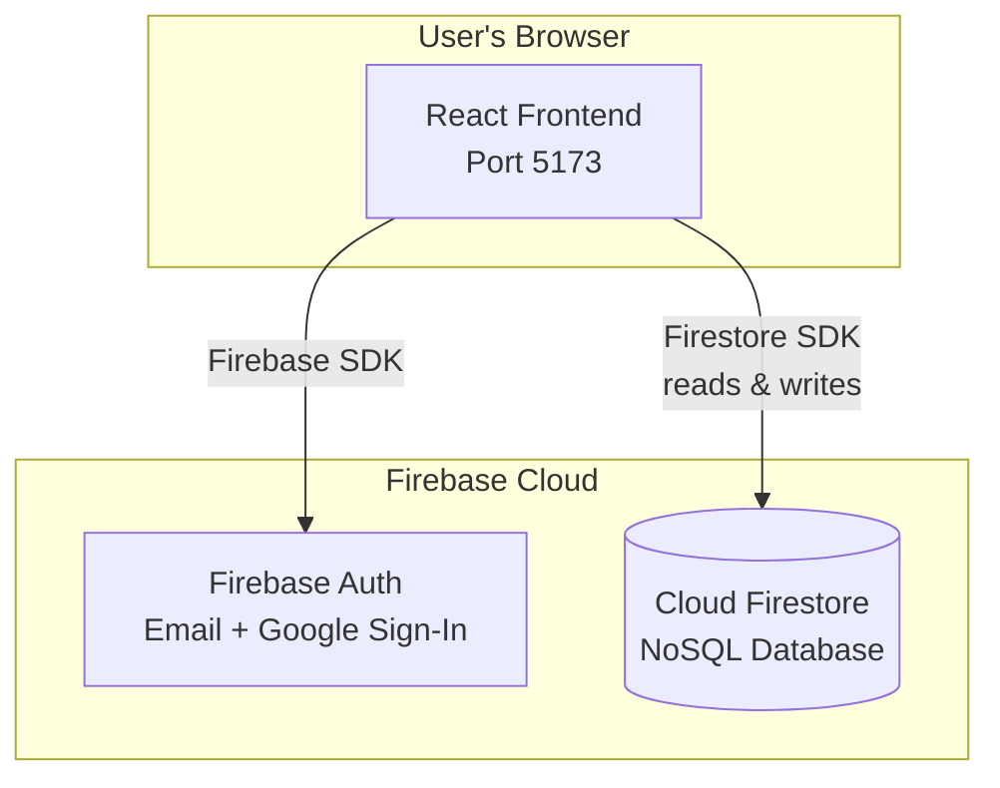

### What Each Part Does

| Component | Technology | Purpose |
|-----------|-----------|---------|
| **Frontend** | React + TypeScript | The user interface — what people see and click on |
| **Authentication** | Firebase Auth | Handles user signup, login (email + Google), session management |
| **Database** | Cloud Firestore | Persistent NoSQL storage — stores users, quizzes, questions, attempts |
| **Scoring** | Client-side (React) | Quiz grading — reads correct answers from Firestore, calculates score, and saves attempt |

## 1.5 Technology Stack Deep Explanation

### Frontend Technologies

#### React 18

- **What it is**: A JavaScript library (made by Facebook/Meta) for building user interfaces. It breaks the UI into reusable "components" (like building blocks).
- **Why chosen**: Industry standard for SPAs (Single-Page Applications). Huge ecosystem. Fast rendering through its Virtual DOM.
- **What problem it solves**: Without React, you'd manually manipulate HTML elements with `document.getElementById()`. React lets you describe what the UI should look like, and it handles the updates efficiently.
- **What would happen if removed**: There would be no user interface. Users would have to interact with raw database queries.
- **Alternatives**: Vue.js, Angular, Svelte, SolidJS.

#### TypeScript 5.8

- **What it is**: A superset of JavaScript that adds static types. You write `const name: string = "Alice"` instead of `const name = "Alice"`.
- **Why chosen**: Catches bugs at compile time (before the code runs). Provides autocomplete and documentation in the editor. Essential for large codebases.
- **What problem it solves**: In plain JavaScript, you might pass a number where a string is expected, and the bug only shows up at runtime. TypeScript catches this instantly.
- **What would happen if removed**: The code would still work (it compiles to JavaScript), but the team loses type safety, editor support, and compile-time error checking.
- **Alternatives**: Plain JavaScript, Flow (Facebook's type checker — largely abandoned).

#### Vite 6

- **What it is**: A build tool and development server. During development, it serves your code with instant hot-module replacement (HMR). For production, it bundles all files into optimized static assets.
- **Why chosen**: Extremely fast startup (uses native ES modules instead of bundling everything upfront). Modern alternative to Webpack.
- **What problem it solves**: Without a build tool, browsers can't understand TypeScript, JSX, or import statements from `node_modules`.
- **What would happen if removed**: You can't compile TypeScript/JSX, can't import npm packages, can't optimize for production.
- **Alternatives**: Webpack, Parcel, esbuild, Turbopack.

#### TailwindCSS 3

- **What it is**: A "utility-first" CSS framework. Instead of writing CSS classes like `.card { padding: 16px; background: white; }`, you write `class="p-4 bg-white"` directly in your HTML/JSX.
- **Why chosen**: Very fast prototyping. No context-switching between CSS files and components. Produces tiny CSS bundles (tree-shakes unused classes).
- **What problem it solves**: Eliminates naming CSS classes, reduces CSS file size, keeps styles co-located with markup.
- **What would happen if removed**: The entire UI would lose its styling — no colors, spacing, layout, or responsive design.
- **Alternatives**: Styled-components, CSS Modules, Sass/SCSS, Bootstrap, Material UI.

#### React Router 7

- **What it is**: A library that handles navigation between pages in a single-page application. The browser URL changes, but the page doesn't fully reload.
- **Why chosen**: De facto standard for client-side routing in React. Supports nested routes, route guards, and URL parameters.
- **What problem it solves**: Without routing, your entire application would be a single page with no URL changes. Users couldn't bookmark pages or navigate with the browser's back button.
- **What would happen if removed**: No navigation. The app would be stuck on one screen.
- **Alternatives**: Next.js (full framework with routing built-in), Wouter.

#### TanStack React Query 5

- **What it is**: A data-fetching and caching library. It manages server state — data that lives on the backend and needs to be fetched, cached, synchronized, and updated.
- **Why chosen**: Handles loading states, error states, caching, refetching, and cache invalidation automatically. Replaces hundreds of lines of manual `useEffect` + `useState` code.
- **What problem it solves**: Without it, every component that fetches data would need its own loading/error state management, retry logic, and caching.
- **What would happen if removed**: You'd need to manually manage Firestore query states with `useEffect` and `useState` in every component.
- **Alternatives**: SWR (Vercel), RTK Query (Redux Toolkit), Apollo Client (for GraphQL).

### Firebase Technologies

#### Firebase Auth

- **What it is**: A managed authentication service from Google. It handles user signup, login, session management, and identity verification — all without writing backend auth code.
- **Why chosen**: Handles password hashing, token generation, token refresh, Google OAuth integration, and session persistence automatically. Eliminates the need for a custom auth backend.
- **What problem it solves**: Without it, you'd need to build login/signup endpoints, hash passwords with bcrypt, generate JWTs, verify tokens on every request, and handle OAuth callbacks manually.
- **What would happen if removed**: No authentication. Users couldn't log in or create accounts.
- **Alternatives**: Auth0, Supabase Auth, AWS Cognito, custom JWT-based auth.

#### Cloud Firestore

- **What it is**: A NoSQL document database from Google. Data is organized in collections (like tables) and documents (like rows), but each document is a JSON-like object with flexible schema.
- **Why chosen**: Real-time capabilities, automatic scaling, built-in security rules, direct access from frontend via SDK (no REST API layer needed), and seamless integration with Firebase Auth.
- **What problem it solves**: Without a database, all data would be lost when the browser is closed. Firestore provides persistent, scalable storage with built-in access control.
- **What would happen if removed**: The application would crash. No users, quizzes, or attempts could be stored or retrieved.
- **Alternatives**: PostgreSQL, MongoDB, Supabase (PostgreSQL), DynamoDB, PlanetScale.

#### Firebase SDK (Client)

- **What it is**: A JavaScript library that connects the React frontend to Firebase services (Auth, Firestore, Functions).
- **Why chosen**: Provides direct, optimized access to Firebase services with built-in caching, offline support, and real-time listeners.
- **What problem it solves**: Without the SDK, you'd need to make raw HTTP requests to Firebase REST APIs, handle authentication tokens manually, and build your own caching layer.
- **What would happen if removed**: The frontend can't communicate with Firebase at all.
- **Alternatives**: Firebase REST API (more code, less features), Supabase JS client.

### Infrastructure Technologies

#### Firebase CLI

- **What it is**: A command-line tool for managing Firebase projects — deploying Firestore rules, indexes, and hosting configurations.
- **Why chosen**: Single tool to deploy all Firebase resources. Supports local emulators for development.
- **What problem it solves**: Without it, you'd need to configure Firebase resources through the web console manually — no version control, no automation.
- **What would happen if removed**: Can't deploy Firestore rules or indexes from the command line.
- **Alternatives**: Firebase web console (manual, not version-controlled), Terraform with Firebase provider.

---

# 2. Architecture

## 2.1 System Design Overview

Quiz Portal follows a **serverless architecture** powered by Firebase:

1. **Presentation Tier** (Frontend) — React SPA running in the browser
2. **Services Tier** (Firebase) — Auth + Firestore
3. **Data Tier** (Firestore) — NoSQL document database

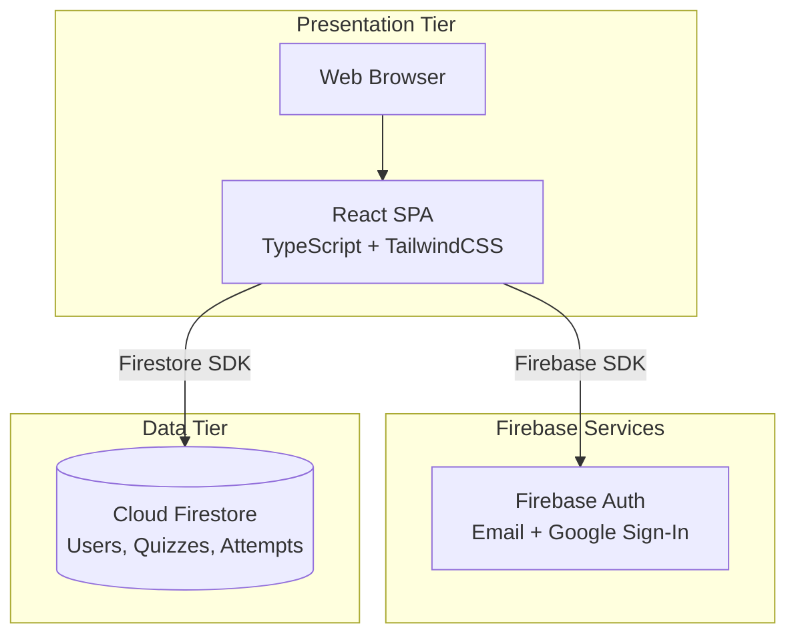

## 2.2 Component Interaction

### Frontend Components

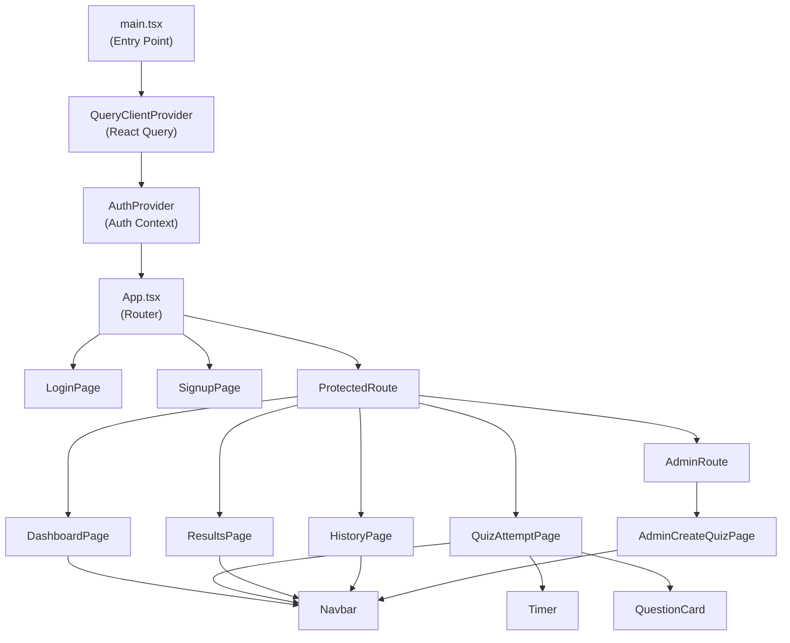

### Firebase Service Interaction

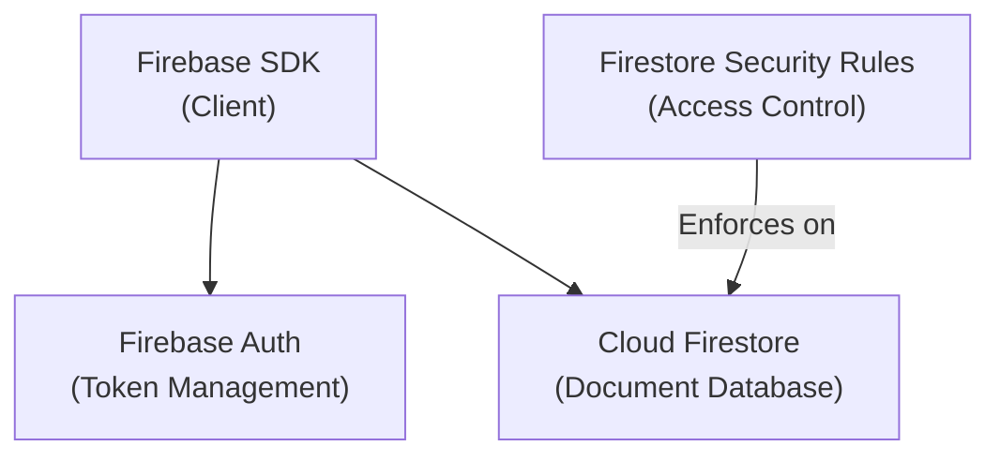

## 2.3 Data Flow

### Authentication Flow (Email/Password)

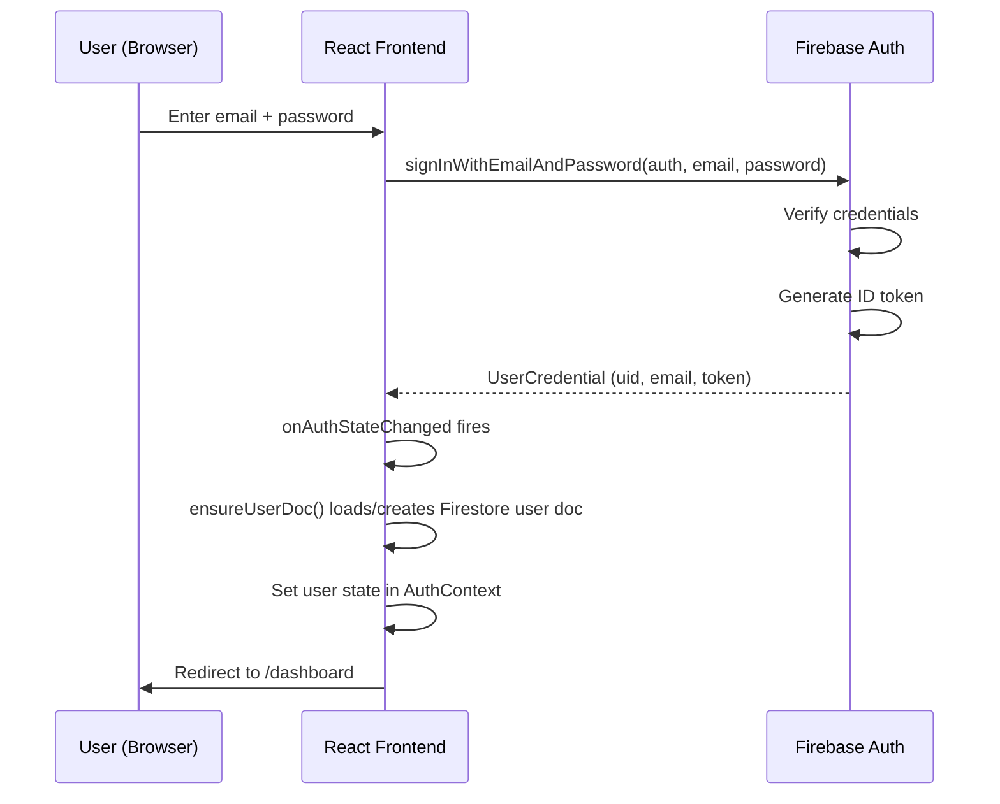

### Authentication Flow (Google)

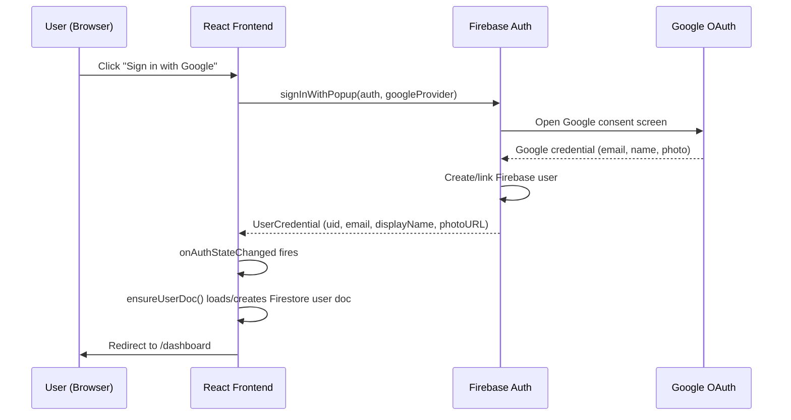

### Quiz Attempt Flow

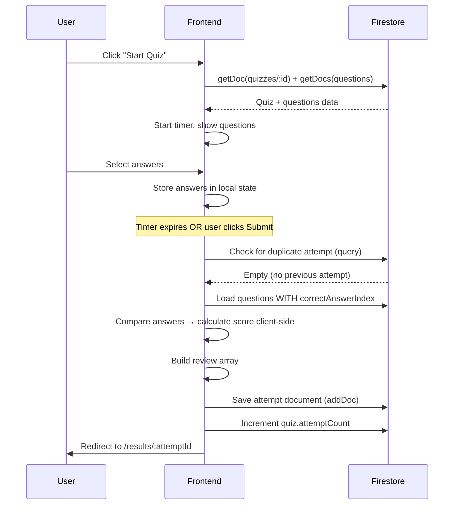

## 2.4 Request Lifecycle

Every Firestore read/write goes through these layers:

```mermaid
graph LR
    A["1. React Component<br/>calls hook"] --> B["2. React Query<br/>checks cache"]
    B --> C["3. Firestore SDK<br/>builds query"]
    C --> D["4. Firebase Auth<br/>attaches ID token"]
    D --> E["5. Firestore Backend<br/>receives request"]
    E --> F["6. Security Rules<br/>evaluate access"]
    F --> G["7. Query Execution<br/>on Firestore"]
    G --> H["8. Response<br/>documents returned"]
    H --> I["9. React Query<br/>caches result"]
    I --> J["10. Component<br/>re-renders"]
```

## 2.5 Service Responsibilities

| Service | Responsibility |
|---------|---------------|
| **Firebase Auth** | User registration, login (email + Google), session management, token refresh |
| **Firestore `users` collection** | Stores user profiles (name, email, role, photo) |
| **Firestore `quizzes` collection** | Stores quiz metadata (title, description, timeLimit) |
| **Firestore `quizzes/{id}/questions`** | Stores questions as a subcollection (includes correctAnswerIndex) |
| **Firestore `attempts` collection** | Stores completed attempts with scores and full review data |
| **Firestore Security Rules** | Controls who can read/write which documents |

---

# 3. Folder Structure

```
Quiz/                              ← Project root (monorepo)
├── README.md                      ← Project documentation
├── DEPLOYMENT.md                  ← Deployment guide
├── .env.example                   ← Template for environment variables
├── .github/
│   └── workflows/ci.yml          ← CI pipeline
│
├── apps/
│   ├── frontend/                  ← React frontend application
│   │   ├── firestore.rules        ← Firestore security rules
│   │   ├── firestore.indexes.json ← Composite index definitions
│   │   ├── vercel.json            ← Vercel SPA rewrite rules
│   │   ├── index.html             ← HTML shell
│   │   ├── package.json           ← Node.js dependencies
│   │   ├── postcss.config.js      ← PostCSS config (for Tailwind)
│   │   ├── tailwind.config.ts     ← TailwindCSS theme + custom classes
│   │   ├── tsconfig.json          ← TypeScript compiler config
│   │   ├── vite.config.ts         ← Vite dev server config
│   │   └── src/
│   │       ├── main.tsx           ← Application entry point
│   │       ├── App.tsx            ← Route definitions
│   │       ├── index.css          ← Global styles + Tailwind directives
│   │       ├── vite-env.d.ts      ← Vite TypeScript declarations
│   │       ├── firebase.ts        ← Firebase SDK initialization (auth + db)
│   │       ├── types.ts           ← All TypeScript interfaces
│   │       ├── api/
│   │       │   └── hooks.ts       ← React Query hooks for all Firestore operations
│   │       ├── context/
│   │       │   └── AuthContext.tsx ← Global auth state (Firebase Auth + Firestore user doc)
│   │       ├── components/
│   │       │   ├── AdminRoute.tsx  ← Route guard: admin only
│   │       │   ├── Navbar.tsx      ← Top navigation bar
│   │       │   ├── ProtectedRoute.tsx ← Route guard: logged in only
│   │       │   ├── QuestionCard.tsx← Single question display
│   │       │   └── Timer.tsx       ← Countdown timer with visual progress
│   │       └── pages/
│   │           ├── LoginPage.tsx          ← Email + Google login
│   │           ├── SignupPage.tsx          ← Registration form
│   │           ├── DashboardPage.tsx       ← Quiz listing grid
│   │           ├── QuizAttemptPage.tsx     ← Take a quiz
│   │           ├── ResultsPage.tsx         ← Score + answer review
│   │           ├── HistoryPage.tsx         ← Past attempts list
│   │           ├── AdminCreateQuizPage.tsx ← Create quiz form (admin)
│   │           └── AdminManageQuizzesPage.tsx ← Manage quizzes (admin)
│   │
│   └── backend/                   ← Django REST API (optional, for local dev)
│       ├── Dockerfile             ← Container build instructions
│       ├── manage.py              ← Django management script
│       ├── requirements.txt       ← Python dependencies
│       ├── quiz_project/          ← Django project settings
│       │   ├── settings.py
│       │   ├── urls.py
│       │   ├── wsgi.py
│       │   └── asgi.py
│       └── quizzes/               ← Django app (models, views, serializers)
│           ├── models.py
│           ├── views/
│           ├── serializers.py
│           ├── authentication.py
│           ├── urls.py
│           └── migrations/
```

### Folder-by-Folder Explanation

#### Root Level

| Item | Purpose | What Happens If Removed |
|------|---------|------------------------|
| `README.md` | Project overview for GitHub | New developers won't know what the project does |
| `DEPLOYMENT.md` | Step-by-step deployment guide | Lose deployment instructions |
| `.env.example` | Template for environment variables | Developers won't know which env vars to set |

#### `apps/frontend/` — Configuration Files

| File | Purpose | What Happens If Removed |
|------|---------|------------------------|
| `firestore.rules` | Security rules enforcing who can read/write which data | All data is either fully exposed or fully blocked |
| `firestore.indexes.json` | Composite indexes for efficient Firestore queries | Complex queries (e.g., filter + sort) fail |
| `vercel.json` | SPA rewrite rules for Vercel hosting | Page refreshes return 404 |

#### `apps/frontend/src/firebase.ts`

| File | Purpose | What Happens If Removed |
|------|---------|------------------------|
| `firebase.ts` | Initializes Firebase app + exports `auth` and `db` singletons | No Firebase service works — entire app breaks |

#### `apps/frontend/src/api/`

The data layer — **how the frontend reads from and writes to Firebase**.

| File | Purpose | What Happens If Removed |
|------|---------|------------------------|
| `hooks.ts` | React Query hooks wrapping every Firestore operation (reads, writes, scoring) | Each component would need its own Firestore query logic with `useEffect` |

#### `apps/frontend/src/context/`

| File | Purpose | What Happens If Removed |
|------|---------|------------------------|
| `AuthContext.tsx` | Listens to Firebase Auth state changes; creates/reads Firestore user docs; provides `login` / `signup` / `logout` | Components can't know if user is logged in; route guards break |

#### `apps/frontend/src/components/`

Reusable UI building blocks.

| Component | Purpose | What Happens If Removed |
|-----------|---------|------------------------|
| `Navbar.tsx` | Top navigation with links + user avatar + logout | No navigation between pages |
| `ProtectedRoute.tsx` | Redirects unauthenticated users to `/login` | Anonymous users see protected pages |
| `AdminRoute.tsx` | Redirects non-admin users to `/dashboard` | Regular users could access admin pages |
| `QuestionCard.tsx` | Renders one question with 4 option buttons | Quiz attempt page shows no questions |
| `Timer.tsx` | Countdown clock with circular progress + auto-submit | No time pressure; quizzes never auto-submit |

#### `apps/frontend/src/pages/`

Each file = one full-screen page.

| Page | Route | Purpose |
|------|-------|---------|
| `LoginPage.tsx` | `/login` | Email/password form + Google Sign-In button |
| `SignupPage.tsx` | `/signup` | Registration form + Google Sign-In |
| `DashboardPage.tsx` | `/dashboard` | Grid of available quizzes |
| `QuizAttemptPage.tsx` | `/quiz/:id` | Take a quiz with timer |
| `ResultsPage.tsx` | `/results/:attemptId` | Score circle + answer review |
| `HistoryPage.tsx` | `/history` | List of past attempts |
| `AdminCreateQuizPage.tsx` | `/admin/create-quiz` | Form to create a new quiz |

---

# 4. Execution Flow

## 4.1 Application Startup

### Frontend Startup

```
1. npx vite (or npm run dev)
   │
   ├── 2. Vite reads vite.config.ts
   │      ├── Loads React plugin
   │      └── Sets up dev server on port 5173
   │
   ├── 3. Browser loads http://localhost:5173
   │      └── Serves index.html
   │
   ├── 4. index.html loads src/main.tsx
   │
   ├── 5. main.tsx initializes providers (outermost → innermost):
   │      ├── React.StrictMode (development checks)
   │      ├── QueryClientProvider (React Query cache)
   │      └── AuthProvider (Firebase Auth listener)
   │
   ├── 6. AuthProvider sets up onAuthStateChanged listener:
   │      ├── Firebase Auth checks for persisted session
   │      ├── If previously logged in → fires with firebase User object
   │      │   ├── ensureUserDoc() reads/creates Firestore user document
   │      │   └── Sets app-level user state
   │      └── If not logged in → fires with null
   │         └── Sets isLoading = false, user = null
   │
   ├── 7. App.tsx renders BrowserRouter + Routes
   │      └── Based on URL, renders the matching page component
   │
   └── 8. If user is authenticated → DashboardPage renders
         If not → ProtectedRoute redirects to /login
```

### Firebase SDK Initialization (`firebase.ts`)

```
1. Import Firebase modules
   ├── firebase/app (core)
   ├── firebase/auth (authentication)
   └── firebase/firestore (database)

2. initializeApp(firebaseConfig)
   ├── Reads VITE_FIREBASE_* env vars
   ├── Creates Firebase app singleton
   └── Connects to correct Firebase project

3. Export service singletons:
   ├── auth = getAuth(app)       → Firebase Authentication
   └── db = getFirestore(app)    → Cloud Firestore
```

## 4.2 Configuration Loading

### Firebase Configuration (Environment Variables)

```bash
# apps/frontend/.env
VITE_FIREBASE_API_KEY=AIza...        # Identifies the Firebase project
VITE_FIREBASE_AUTH_DOMAIN=xxx.firebaseapp.com   # Auth redirect domain
VITE_FIREBASE_PROJECT_ID=quiz-portal-afa55      # Project identifier
VITE_FIREBASE_STORAGE_BUCKET=xxx.appspot.com    # Storage bucket (optional)
VITE_FIREBASE_MESSAGING_SENDER_ID=123456789     # Cloud Messaging ID
VITE_FIREBASE_APP_ID=1:123:web:abc...           # Unique app ID

VITE_ADMIN_EMAILS=admin@example.com  # Comma-separated admin emails
```

**Note:** Firebase API keys are safe to expose in client-side code. They only identify the project — all actual security is enforced by **Firestore Security Rules** and **Firebase Auth**.

### Frontend Configuration

| Source | What It Configures |
|--------|--------------------|
| `vite.config.ts` | Dev server port (5173), React plugin |
| `tailwind.config.ts` | Custom colors (brand, surface), fonts, animations |
| `.env` | Firebase project credentials, admin email list |

## 4.3 Firestore Query Handling (Step by Step)

Let's trace how `useQuizzes()` fetches published quizzes:

```
React Component (DashboardPage)
   │
   │  1. Calls useQuizzes() hook
   │
   │  2. React Query checks cache
   │     ├── Cache HIT + fresh → return cached data immediately
   │     └── Cache MISS or stale → execute queryFn
   │
   │  3. queryFn fires Firestore query:
   │     query(
   │       collection(db, "quizzes"),
   │       where("isPublished", "==", true),
   │       orderBy("createdAt", "desc")
   │     )
   │
   │  4. Firebase SDK attaches current user's ID token
   │
   │  5. Firestore backend receives request:
   │     a. Evaluates security rules:
   │        "allow read: if isAuth()" → checks request.auth != null ✓
   │     b. Checks composite index exists for (isPublished + createdAt DESC)
   │     c. Executes query → returns matching documents
   │
   │  6. SDK receives DocumentSnapshot array
   │
   │  7. Hook maps snapshots to QuizSummary objects:
   │     { id, title, description, timeLimit, createdAt, creator, questionCount, attemptCount }
   │
   │  8. React Query caches result (staleTime: 30s)
   │
   │  9. Component re-renders with quiz data
   │
   └── 10. User sees quiz cards on screen
```

## 4.4 Quiz Submission Handling

Let's trace how `useSubmitAttempt()` scores and saves a quiz attempt:

```
React Component (QuizAttemptPage)
   │
   │  1. User clicks "Submit Quiz" or timer expires
   │
   │  2. handleSubmit() calls submitMutation.mutateAsync({quizId, answers, startedAt})
   │
   │  3. mutationFn fires:
   │     a. Check auth: auth.currentUser exists? ✓
   │     b. Check duplicate: query attempts where quizId + userId match
   │     c. Load quiz metadata from Firestore
   │     d. Load all questions (WITH correctAnswerIndex)
   │     e. Grade: compare each answer to correctAnswerIndex → count score
   │     f. Build review array with question details + isCorrect flags
   │     g. Save attempt document to Firestore (addDoc)
   │     h. Increment quiz.attemptCount (atomic increment)
   │
   │  4. React Query invalidates "history" and "quizzes" caches
   │
   └── 5. navigate("/results/:attemptId") → user sees score
```

## 4.5 Frontend UI Update Cycle

When the user navigates to `/dashboard`:

```
1. React Router matches /dashboard → renders <ProtectedRoute><DashboardPage /></ProtectedRoute>

2. ProtectedRoute checks useAuth().isAuthenticated
   - If false → <Navigate to="/login" />
   - If true → renders <DashboardPage />

3. DashboardPage calls useQuizzes() hook

4. useQuizzes() → Firestore query for published quizzes
   - Shows loading skeleton while waiting
   - On success → stores data in React Query cache, re-renders component

5. DashboardPage maps over quiz array → renders quiz cards

6. User clicks "Start Quiz" → <Link to="/quiz/abc123"> triggers navigation

7. React Router renders QuizAttemptPage with id="abc123"
   - useQuiz("abc123") fetches quiz detail + questions from Firestore
   - Timer starts counting down
   - User answers questions (state updates locally)
   - On submit → useSubmitAttempt() grades answers and saves to Firestore
   - Success → navigate("/results/xyz789")
```

---

# 5. Connection Flow

## 5.1 Frontend → Firestore

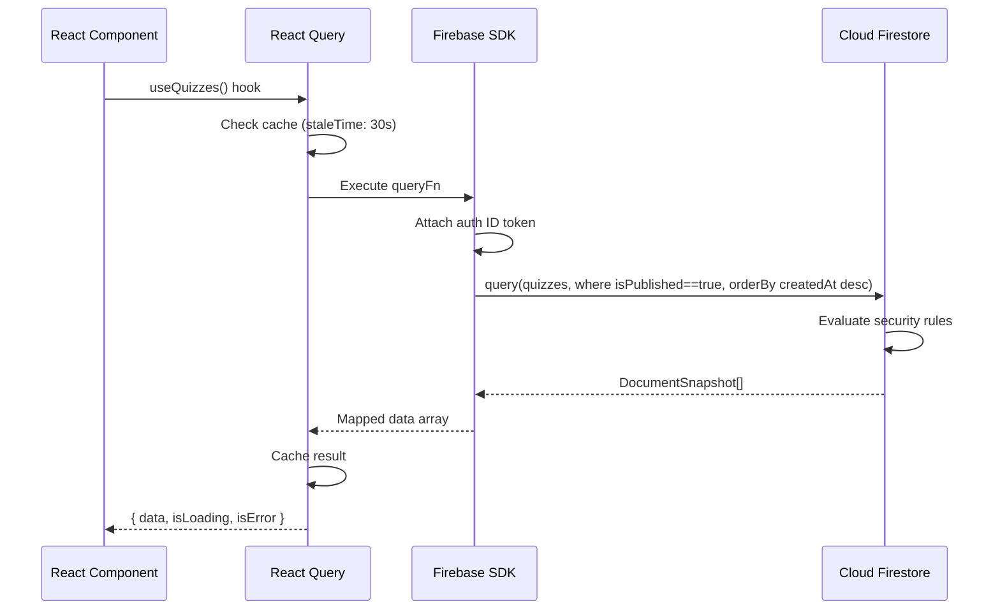

**How it works:**
1. React Query manages caching, deduplication, and refetching.
2. The Firebase SDK handles serialization, token attachment, and transport.
3. Firestore Security Rules evaluate every read/write against `request.auth`.
4. No proxy, no REST API layer — the SDK connects directly to Firestore.

## 5.2 Frontend → Firestore (Quiz Submission)

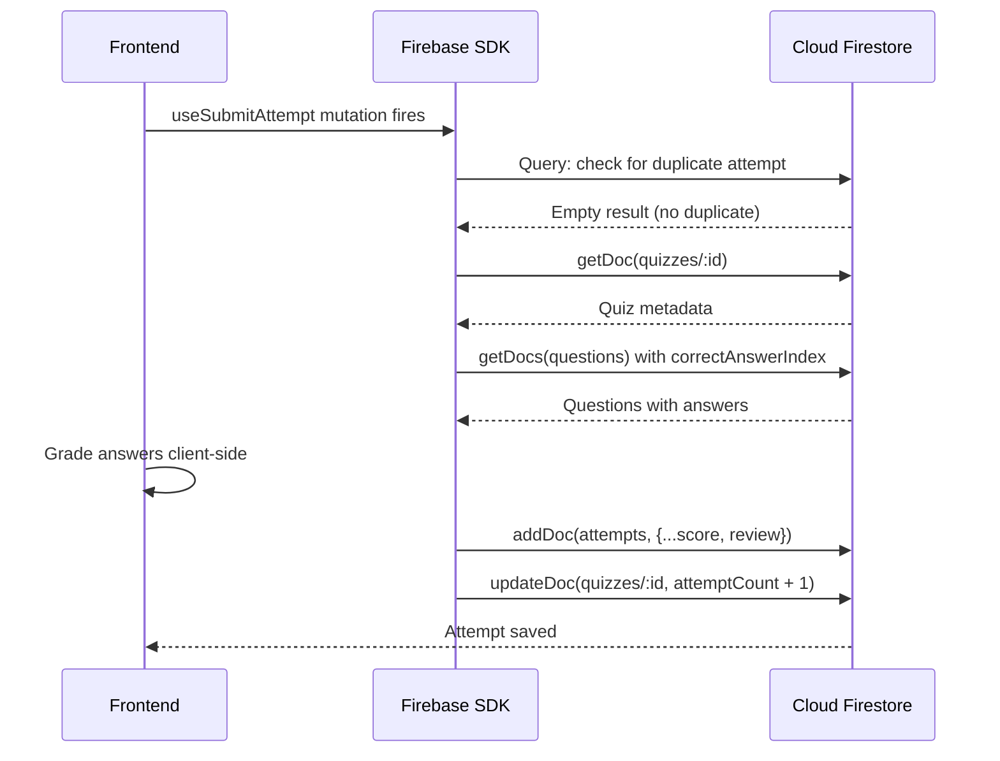

**How it works:**
1. The frontend reads questions including `correctAnswerIndex` from Firestore.
2. Scoring happens client-side — answers are compared to correct answers in the React app.
3. The attempt document (with score and review) is written directly to Firestore.
4. Firestore Security Rules enforce that users can only create attempts with their own `userId`.

## 5.3 Frontend → Firebase Auth

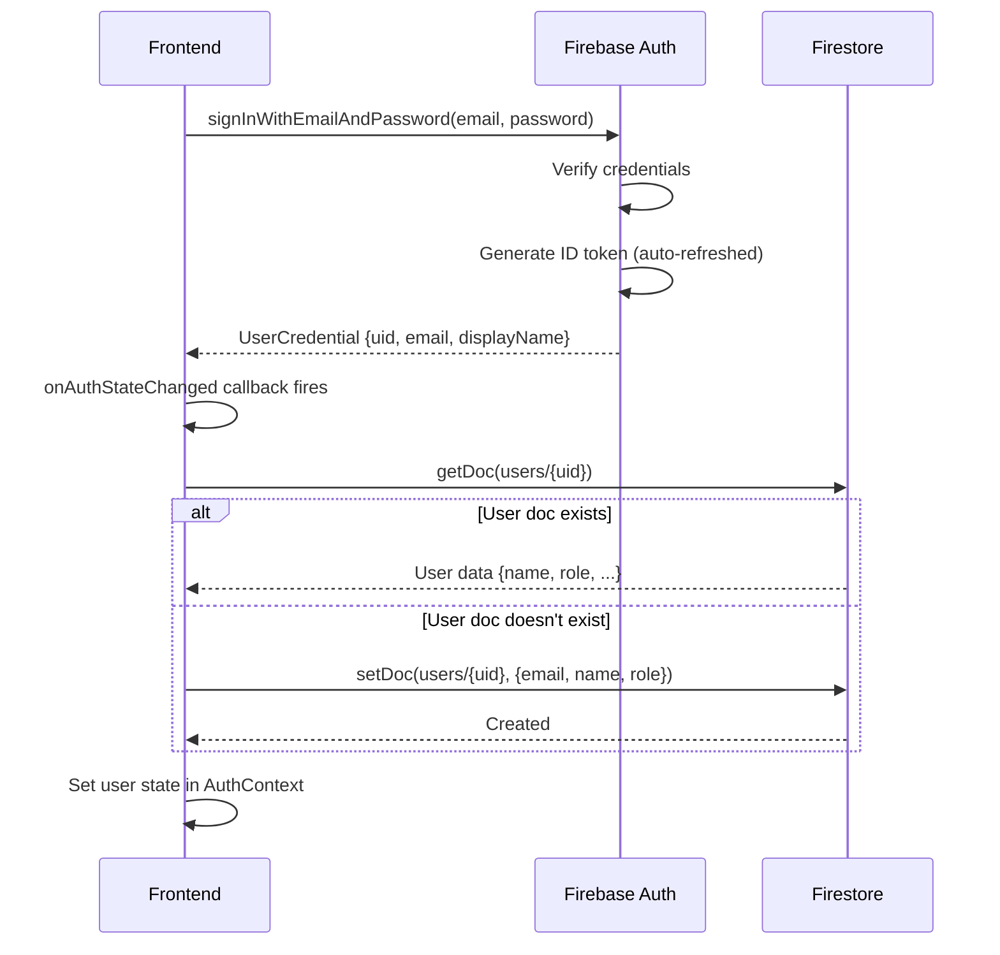

## 5.4 Complete Request Journey

Here's how a quiz attempt travels through every layer:

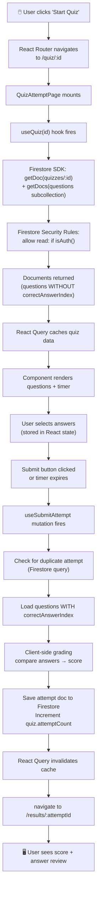

## 5.5 Error Handling Flow

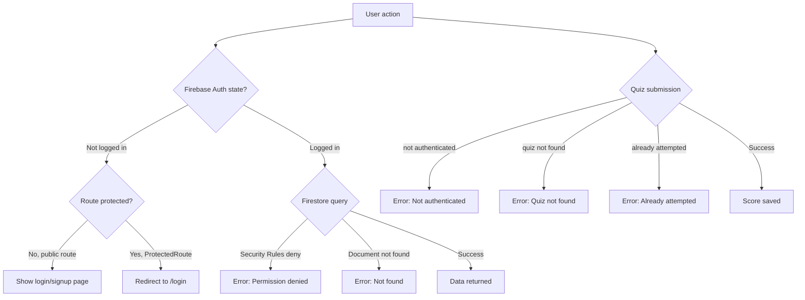

When the frontend encounters an error:

```
Firebase Auth errors → AuthContext catches, shows user-friendly message via firebaseErrorMessage()
Firestore errors    → React Query's isError flag, component shows error state
Submission errors   → Error thrown in mutationFn, component shows error message
Network errors      → React Query retry (1 attempt), then shows error state
```

---

# 6. Code Deep Dive

## 6.1 Firebase Initialization — `firebase.ts`

```typescript
import { initializeApp } from "firebase/app";
import { getAuth } from "firebase/auth";
import { getFirestore } from "firebase/firestore";

const firebaseConfig = {
  apiKey: import.meta.env.VITE_FIREBASE_API_KEY,
  authDomain: import.meta.env.VITE_FIREBASE_AUTH_DOMAIN,
  projectId: import.meta.env.VITE_FIREBASE_PROJECT_ID,
  storageBucket: import.meta.env.VITE_FIREBASE_STORAGE_BUCKET,
  messagingSenderId: import.meta.env.VITE_FIREBASE_MESSAGING_SENDER_ID,
  appId: import.meta.env.VITE_FIREBASE_APP_ID,
};

const app = initializeApp(firebaseConfig);
export const auth = getAuth(app);
export const db = getFirestore(app);
```

- **Line 6–13**: Reads Firebase credentials from environment variables. The `VITE_` prefix is required by Vite to expose env vars to client code.
- **Line 15**: `initializeApp()` creates a Firebase app singleton — all services share this connection.
- **Line 16**: `getAuth()` returns the Auth service — used for login, signup, and session management.
- **Line 17**: `getFirestore()` returns the Firestore database service — used for all document reads/writes.
- **If removed**: The entire application breaks — no Firebase service can be accessed.

## 6.2 Auth Context — `context/AuthContext.tsx`

### Admin Detection

```typescript
const ADMIN_EMAILS = (
  import.meta.env.VITE_ADMIN_EMAILS || "admin@example.com"
)
  .split(",")
  .map((e: string) => e.trim().toLowerCase());
```

- Reads admin emails from environment variable, splits by comma, normalizes to lowercase.
- This list determines who gets the `ADMIN` role in Firestore.

### User Document Management — `ensureUserDoc()`

```typescript
async function ensureUserDoc(
  uid: string, email: string, name: string, photoUrl: string | null,
): Promise<User> {
  const ref = doc(db, "users", uid);
  const snap = await getDoc(ref);

  if (snap.exists()) {
    const data = snap.data();
    const isAdmin = ADMIN_EMAILS.includes(email.toLowerCase());
    if (isAdmin && data.role !== "ADMIN") {
      await setDoc(ref, { role: "ADMIN" }, { merge: true });
      // ↑ Promote to admin if their email is in the admin list
      data.role = "ADMIN";
    }
    return { id: uid, email: data.email, name: data.name, ... };
  }

  // First-time user — create document
  const isAdmin = ADMIN_EMAILS.includes(email.toLowerCase());
  const newUser = {
    email, name, photoUrl,
    role: isAdmin ? "ADMIN" : "USER",
    createdAt: Timestamp.now(),
  };
  await setDoc(ref, newUser);
  return { id: uid, ...newUser };
}
```

- Called every time Firebase Auth state changes (login, page refresh).
- Uses the Firebase user's `uid` as the Firestore document ID — guarantees 1:1 mapping.
- If the user doc already exists, reads it. If not, creates it.
- Automatically promotes users whose email is in the `VITE_ADMIN_EMAILS` list.

### Auth State Listener

```typescript
useEffect(() => {
  const unsub = onAuthStateChanged(auth, async (firebaseUser) => {
    if (firebaseUser) {
      const appUser = await ensureUserDoc(
        firebaseUser.uid,
        firebaseUser.email ?? "",
        firebaseUser.displayName ?? firebaseUser.email?.split("@")[0] ?? "",
        firebaseUser.photoURL,
      );
      setUser(appUser);
    } else {
      setUser(null);
    }
    setIsLoading(false);
  });
  return unsub;  // Cleanup subscription on unmount
}, []);
```

- `onAuthStateChanged` is Firebase's core auth listener. It fires:
  1. On initial page load (checks persisted session).
  2. After `signInWithEmailAndPassword()` or `signInWithPopup()`.
  3. After `signOut()`.
- Returns an unsubscribe function — React's cleanup prevents memory leaks.

### Login Methods

```typescript
const loginWithEmail = useCallback(
  async (email: string, password: string) => {
    await signInWithEmailAndPassword(auth, email, password);
    // onAuthStateChanged fires automatically → ensureUserDoc → setUser
  }, [],
);

const loginWithGoogle = useCallback(async () => {
  await signInWithPopup(auth, googleProvider);
  // Opens Google consent popup → onAuthStateChanged fires on success
}, []);

const logout = useCallback(() => {
  signOut(auth);
  setUser(null);
}, []);
```

- All three methods are thin wrappers around Firebase Auth SDK calls.
- The actual user state update happens in `onAuthStateChanged`, not in these methods.
- `signInWithPopup` opens the Google consent screen in a popup window.

## 6.3 Quiz Scoring — `api/hooks.ts` (`useSubmitAttempt`)

Quiz scoring is performed **client-side** in the `useSubmitAttempt` React Query mutation:

```typescript
export function useSubmitAttempt() {
  const queryClient = useQueryClient();

  return useMutation({
    mutationFn: async (input: {
      quizId: string;
      answers: Record<string, number>;
      startedAt: string;
    }) => {
      const fbUser = auth.currentUser;
      if (!fbUser) throw new Error("Not authenticated");

      // Check for duplicate attempt
      const existingSnap = await getDocs(
        query(
          collection(db, "attempts"),
          where("quizId", "==", input.quizId),
          where("userId", "==", fbUser.uid),
        ),
      );
      if (!existingSnap.empty) {
        throw new Error("You have already attempted this quiz.");
      }

      // Load quiz metadata
      const quizSnap = await getDoc(doc(db, "quizzes", input.quizId));
      if (!quizSnap.exists()) throw new Error("Quiz not found");
      const quizData = quizSnap.data();

      // Load questions with correct answers
      const questionsSnap = await getDocs(
        query(
          collection(db, "quizzes", input.quizId, "questions"),
          orderBy("order"),
        ),
      );

      // Grade client-side
      let score = 0;
      const totalScore = questionsSnap.size;
      const review = questionsSnap.docs.map((qDoc) => {
        const qData = qDoc.data();
        const selected =
          input.answers[qDoc.id] !== undefined ? input.answers[qDoc.id] : -1;
        const isCorrect = selected === qData.correctAnswerIndex;
        if (isCorrect) score++;
        return {
          questionId: qDoc.id,
          questionText: qData.questionText as string,
          options: qData.options as string[],
          correctAnswerIndex: qData.correctAnswerIndex as number,
          selectedAnswerIndex: selected,
          isCorrect,
        };
      });

      // Save attempt
      const attemptRef = await addDoc(collection(db, "attempts"), {
        quizId: input.quizId,
        quizTitle: quizData.title,
        quizDescription: quizData.description ?? "",
        questionCount: totalScore,
        userId: fbUser.uid,
        answers: input.answers,
        score,
        totalScore,
        startedAt: Timestamp.fromDate(new Date(input.startedAt)),
        submittedAt: Timestamp.now(),
        review,
      });

      // Increment quiz attempt counter
      await updateDoc(doc(db, "quizzes", input.quizId), {
        attemptCount: increment(1),
      });

      return { id: attemptRef.id, quizId, quizTitle, score, totalScore } as AttemptResult;
    },
    onSuccess: () => {
      queryClient.invalidateQueries({ queryKey: ["history"] });
      queryClient.invalidateQueries({ queryKey: ["quizzes"] });
    },
  });
}
```

**Step-by-step:**
1. **Auth check** — ensures a user is logged in before proceeding.
2. **Duplicate check** — queries Firestore for existing attempts by this user for this quiz.
3. **Load quiz + questions** — reads quiz metadata and all questions including `correctAnswerIndex`.
4. **Grade** — compares each answer to the correct answer, counts score, builds review array.
5. **Save** — writes the attempt document (with score and review) to Firestore.
6. **Counter** — atomically increments the quiz's `attemptCount`.
7. **Cache invalidation** — on success, invalidates React Query caches for history and quiz listings.

## 6.4 React Query Hooks — `api/hooks.ts`

### useQuizzes

```typescript
export function useQuizzes() {
  return useQuery({
    queryKey: ["quizzes"],
    queryFn: async () => {
      const q = query(
        collection(db, "quizzes"),
        where("isPublished", "==", true),
        orderBy("createdAt", "desc"),
      );
      const snap = await getDocs(q).catch(async (err) => {
        if (err.code === "failed-precondition") {
          // Composite index not ready → fallback to simpler query
          const fallback = query(
            collection(db, "quizzes"),
            where("isPublished", "==", true),
          );
          return getDocs(fallback);
        }
        throw err;
      });
      return snap.docs.map((d) => {
        const data = d.data();
        return { id: d.id, title: data.title, ... } as QuizSummary;
      });
    },
    staleTime: 30 * 1000,
    enabled: !!auth.currentUser,
    // ↑ Don't fire query until Firebase Auth is ready
  });
}
```

- The `enabled: !!auth.currentUser` guard prevents the query from firing before authentication completes — without it, the query would fail with permission errors.
- The `.catch()` fallback handles the case where Firestore's composite index hasn't been created yet (common during initial setup).
- **What `useQuizzes()` returns:**

```typescript
{
  data: QuizSummary[] | undefined,  // The quiz array (undefined while loading)
  isLoading: boolean,               // True during first fetch
  isError: boolean,                 // True if request failed
  error: Error | null,              // The error object
  refetch: () => void,              // Manual refetch function
}
```

### useQuiz (Single Quiz with Questions)

```typescript
export function useQuiz(id: string) {
  return useQuery({
    queryKey: ["quiz", id],
    queryFn: async () => {
      const quizSnap = await getDoc(doc(db, "quizzes", id));
      if (!quizSnap.exists()) throw new Error("Quiz not found");
      const data = quizSnap.data();

      const qSnap = await getDocs(
        query(collection(db, "quizzes", id, "questions"), orderBy("order")),
      );
      const questions = qSnap.docs.map((qd) => ({
        id: qd.id,
        questionText: qd.data().questionText,
        options: qd.data().options,
        order: qd.data().order,
      }));

      return { id, title: data.title, ..., questions } as QuizDetail;
    },
    enabled: !!id,
  });
}
```

- Fetches quiz metadata + all questions in two queries (doc read + collection query).
- Questions are fetched from a subcollection: `quizzes/{quizId}/questions`.

### useCreateQuiz (Admin)

```typescript
export function useCreateQuiz() {
  return useMutation({
    mutationFn: async (input: CreateQuizInput) => {
      const fbUser = auth.currentUser;
      if (!fbUser) throw new Error("Not authenticated");

      // Get creator name
      const userSnap = await getDoc(doc(db, "users", fbUser.uid));
      const userName = userSnap.exists()
        ? userSnap.data().name
        : fbUser.displayName || "Unknown";

      // Create quiz document
      const quizRef = await addDoc(collection(db, "quizzes"), {
        title: input.title,
        description: input.description,
        timeLimit: input.timeLimit,
        isPublished: true,
        createdBy: fbUser.uid,
        creatorName: userName,
        questionCount: input.questions.length,
        attemptCount: 0,
        createdAt: Timestamp.now(),
      });

      // Create questions as subcollection (batch write)
      const batch = writeBatch(db);
      input.questions.forEach((q, idx) => {
        const qRef = doc(collection(db, "quizzes", quizRef.id, "questions"));
        batch.set(qRef, {
          questionText: q.questionText,
          options: q.options,
          correctAnswerIndex: q.correctAnswerIndex,
          order: idx,
        });
      });
      await batch.commit();
      // ↑ Batch write = atomic. All questions are created in a single operation.
      //   If any fails, none are created.
    },
    onSuccess: () => {
      queryClient.invalidateQueries({ queryKey: ["quizzes"] });
    },
  });
}
```

- **Two-step creation**: First creates the quiz document, then batch-writes all questions as a subcollection.
- `writeBatch` ensures atomicity — either all questions are created, or none are.
- Firestore Security Rules enforce that only admins can `create` quiz documents (via `isAdmin()` rule function).

## 6.5 Frontend Entry — `main.tsx`

```tsx
const queryClient = new QueryClient({
  defaultOptions: {
    queries: {
      retry: 1,                    // Retry failed requests once
      refetchOnWindowFocus: false,  // Don't refetch when user tabs back
      staleTime: 30 * 1000,        // Data is "fresh" for 30 seconds
    },
  },
});

ReactDOM.createRoot(document.getElementById("root")!).render(
  <React.StrictMode>
    <QueryClientProvider client={queryClient}>
      <AuthProvider>
        <App />
      </AuthProvider>
    </QueryClientProvider>
  </React.StrictMode>,
);
// ↑ Providers are nested like Russian dolls:
//   StrictMode → ReactQuery → Auth → App
//   Each provider makes its value available to all children via React Context
```

**Note:** Unlike the previous architecture, there is no `GoogleOAuthProvider` wrapper. Firebase Auth handles Google Sign-In natively through `signInWithPopup()` — no separate Google SDK needed.

## 6.6 Route Guards — `ProtectedRoute.tsx`

```tsx
export default function ProtectedRoute({ children }: { children: React.ReactNode }) {
  const { isAuthenticated, isLoading } = useAuth();
  const location = useLocation();

  if (isLoading) {
    return <div className="animate-pulse">Loading…</div>;
  }
  // ↑ While AuthProvider's onAuthStateChanged is checking the session,
  //   show a loading indicator. Prevents flash of login page on refresh.

  if (!isAuthenticated) {
    return <Navigate to="/login" state={{ from: location }} replace />;
  }
  // ↑ If not logged in, redirect to /login.
  //   state={{ from: location }} saves where the user was trying to go.

  return <>{children}</>;
}
```

## 6.7 Timer Component — `Timer.tsx`

```tsx
export default function Timer({ totalSeconds, onTimeUp }: TimerProps) {
  const [remaining, setRemaining] = useState(totalSeconds);
  const onTimeUpRef = useRef(onTimeUp);
  onTimeUpRef.current = onTimeUp;
  const firedRef = useRef(false);
  // ↑ useRef avoids stale closure problem
  //   Without it, onTimeUp would capture the initial handleSubmit function
  //   which has an empty `answers` object

  useEffect(() => {
    const interval = setInterval(() => {
      setRemaining((prev) => {
        if (prev <= 1) {
          clearInterval(interval);
          if (!firedRef.current) {
            firedRef.current = true;
            setTimeout(() => onTimeUpRef.current(), 0);
            // ↑ setTimeout(fn, 0) defers the callback to avoid
            //   calling setState during a render cycle
          }
          return 0;
        }
        return prev - 1;
      });
    }, 1000);

    return () => clearInterval(interval);
    // ↑ Cleanup: stop the timer if the component unmounts
  }, []);

  const percentage = (remaining / totalSeconds) * 100;
  const isUrgent = remaining <= 30;
  // ↑ Last 30 seconds → red color + pulse animation
```

- `firedRef` prevents double-firing of `onTimeUp` (which happened in strict mode).
- The timer uses `setInterval` with 1-second ticks for countdown.
- Visual feedback: circular SVG progress indicator + color changes at 60s (amber) and 30s (red).

---

# 7. Database Explanation

## 7.1 Firestore Data Model

Firestore is a **NoSQL document database**. Unlike relational databases (PostgreSQL, MySQL), data is stored as **documents** inside **collections** — not as rows inside tables.

| Concept | SQL Equivalent | Firestore |
|---------|---------------|-----------|
| Table | `CREATE TABLE users` | Collection: `users` |
| Row | `INSERT INTO users VALUES (...)` | Document: `users/{uid}` |
| Column | `email VARCHAR(255)` | Field: `email: "alice@ex.com"` |
| Foreign Key | `REFERENCES quizzes(id)` | String field: `quizId: "abc123"` |
| Auto-increment ID | `SERIAL PRIMARY KEY` | Auto-generated document ID |

### Collection Structure

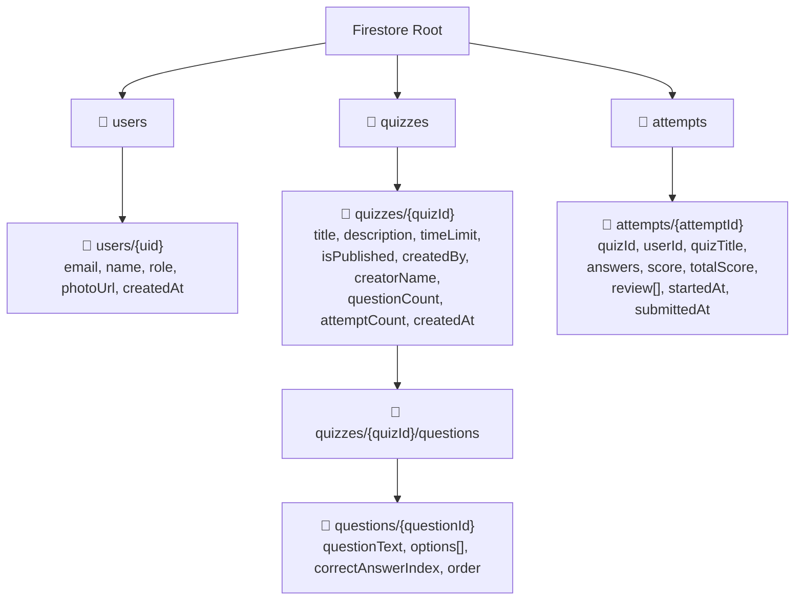

## 7.2 Collection Details

### `users` Collection

Each document ID is the Firebase Auth `uid` — ensuring a 1:1 mapping.

| Field | Type | Description |
|-------|------|-------------|
| `email` | string | User's email address |
| `name` | string | Display name |
| `photoUrl` | string \| null | Google profile picture URL |
| `role` | string | `"USER"` or `"ADMIN"` |
| `createdAt` | Timestamp | When account was created |

### `quizzes` Collection

| Field | Type | Description |
|-------|------|-------------|
| `title` | string | Quiz title |
| `description` | string | Quiz description |
| `timeLimit` | number | Duration in seconds (30–7200) |
| `isPublished` | boolean | Whether visible to users |
| `createdBy` | string | Admin's `uid` |
| `creatorName` | string | Admin's display name (denormalized) |
| `questionCount` | number | Number of questions (denormalized) |
| `attemptCount` | number | Number of attempts (incremented atomically) |
| `createdAt` | Timestamp | Creation timestamp |

### `quizzes/{quizId}/questions` Subcollection

| Field | Type | Description |
|-------|------|-------------|
| `questionText` | string | The question |
| `options` | string[] | Array of 4 answer choices |
| `correctAnswerIndex` | number | Index (0–3) of correct option |
| `order` | number | Display order within quiz |

**Why a subcollection instead of an array field?**
- Firestore documents have a 1MB size limit — a quiz with many questions could exceed this.
- Subcollections allow querying questions independently.
- Questions can be added/removed without rewriting the entire quiz document.

### `attempts` Collection

| Field | Type | Description |
|-------|------|-------------|
| `quizId` | string | Which quiz was attempted |
| `userId` | string | Who attempted it |
| `quizTitle` | string | Quiz title (denormalized for fast display) |
| `quizDescription` | string | Quiz description (denormalized) |
| `questionCount` | number | Total questions |
| `answers` | map | `{questionId: selectedIndex}` |
| `score` | number | Number of correct answers |
| `totalScore` | number | Total questions in quiz |
| `startedAt` | Timestamp | When user started the quiz |
| `submittedAt` | Timestamp | When submitted (server timestamp) |
| `review` | array | Full review data (see below) |

**Each element of the `review` array:**

| Field | Type | Description |
|-------|------|-------------|
| `questionId` | string | Question document ID |
| `questionText` | string | The question text |
| `options` | string[] | The 4 options |
| `correctAnswerIndex` | number | Index of correct answer |
| `selectedAnswerIndex` | number | User's selected answer (-1 if unanswered) |
| `isCorrect` | boolean | Whether the answer was correct |

**Why denormalize** (store quiz title, description in the attempt)?
- In Firestore, there are no JOINs. To show attempt history, you'd need to fetch each quiz document separately — N+1 queries.
- By storing the quiz title/description in the attempt, a single query on `attempts` returns everything the UI needs.

## 7.3 Indexes

Firestore automatically creates indexes for single-field queries. **Composite indexes** (multiple fields) must be defined explicitly.

| Index | Collection | Fields | Purpose |
|-------|-----------|--------|---------|
| Auto | quizzes | `isPublished` | Filter published quizzes |
| **Composite** | quizzes | `isPublished` ASC + `createdAt` DESC | Filter published quizzes sorted by newest |
| Auto | attempts | `userId` | Filter attempts by user |
| **Composite** | attempts | `userId` ASC + `submittedAt` DESC | User's attempt history sorted by date |
| **Composite** | attempts | `quizId` ASC + `userId` ASC | Check if user already attempted a quiz |

These are defined in `firestore.indexes.json` and deployed with `firebase deploy --only firestore:indexes`.

## 7.4 Relationships

| Relationship | How It's Modeled |
|-------------|-----------------|
| User → Quizzes | `quizzes.createdBy` = User's `uid` |
| Quiz → Questions | Subcollection: `quizzes/{quizId}/questions` |
| Quiz → Attempts | `attempts.quizId` = Quiz's document ID |
| User → Attempts | `attempts.userId` = User's `uid` |
| One attempt per user per quiz | Enforced client-side (duplicate check query before insert) |

**No cascade deletes in Firestore** — unlike SQL, deleting a quiz does NOT auto-delete its questions or attempts. You'd need to handle this in application logic or Cloud Functions if needed.

## 7.5 Data Flow Diagram

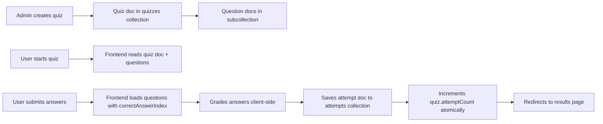

---

# 8. API Documentation

## 8.1 Overview

Quiz Portal uses **direct Firestore SDK calls** for all data operations — reads, writes, and quiz scoring. There is no REST API or Cloud Functions layer. The Firebase SDK communicates directly with Firestore from the browser.

## 8.2 Firestore Queries (Read Operations)

### Fetch Published Quizzes

```typescript
// Hook: useQuizzes()
const q = query(
  collection(db, "quizzes"),
  where("isPublished", "==", true),
  orderBy("createdAt", "desc"),
);
const snap = await getDocs(q);
```

| Property | Details |
|----------|---------|
| **Auth Required** | Yes (Firestore rule: `isAuth()`) |
| **Returns** | Array of `QuizSummary` objects |

### Fetch Quiz Detail with Questions

```typescript
// Hook: useQuiz(id)
const quizSnap = await getDoc(doc(db, "quizzes", id));
const qSnap = await getDocs(
  query(collection(db, "quizzes", id, "questions"), orderBy("order")),
);
```

| Property | Details |
|----------|---------|
| **Auth Required** | Yes |
| **Returns** | `QuizDetail` with `questions[]` array (no `correctAnswerIndex`) |

### Fetch User Profile

```typescript
// Hook: useMe()
const snap = await getDoc(doc(db, "users", fbUser.uid));
```

| Property | Details |
|----------|---------|
| **Auth Required** | Yes (rule: `request.auth.uid == userId`) |
| **Returns** | `User` object |

### Fetch Attempt History

```typescript
// Hook: useHistory(userId)
const q = query(
  collection(db, "attempts"),
  where("userId", "==", userId),
  orderBy("submittedAt", "desc"),
);
```

| Property | Details |
|----------|---------|
| **Auth Required** | Yes (rule: `resource.data.userId == request.auth.uid`) |
| **Returns** | Array of `AttemptHistoryItem` |

### Fetch Attempt Detail

```typescript
// Hook: useAttemptDetail(attemptId)
const snap = await getDoc(doc(db, "attempts", attemptId));
```

| Property | Details |
|----------|---------|
| **Auth Required** | Yes (rule: `resource.data.userId == request.auth.uid`) |
| **Returns** | `AttemptDetail` with `review[]` array |

## 8.3 Firestore Writes

### Create Quiz (Admin Only)

```typescript
// Hook: useCreateQuiz()
const quizRef = await addDoc(collection(db, "quizzes"), { title, description, ... });
const batch = writeBatch(db);
questions.forEach((q, idx) => {
  batch.set(doc(collection(db, "quizzes", quizRef.id, "questions")), { ... });
});
await batch.commit();
```

| Property | Details |
|----------|---------|
| **Auth Required** | Yes |
| **Role Required** | ADMIN (rule: `isAdmin()`) |
| **Validation** | Client-side: title, description, timeLimit (30-7200), questions (≥1), options (4 non-empty), correctAnswerIndex (0-3) |

### Create/Update User Doc

```typescript
// Called in AuthContext.ensureUserDoc()
await setDoc(ref, newUser);                          // Create
await setDoc(ref, { role: "ADMIN" }, { merge: true }); // Update
```

| Property | Details |
|----------|---------|
| **Auth Required** | Yes (rule: `request.auth.uid == userId`) |

## 8.4 Frontend–Firestore Interaction Summary

| Frontend Hook | Operation | Firestore Path | When Called |
|--------------|-----------|---------------|------------|
| `useMe()` | `getDoc` | `users/{uid}` | On app load (if authenticated) |
| `useQuizzes()` | `getDocs` + query | `quizzes` (where isPublished) | Dashboard page loads |
| `useQuiz(id)` | `getDoc` + `getDocs` | `quizzes/{id}` + `quizzes/{id}/questions` | Quiz attempt page loads |
| `useCreateQuiz()` | `addDoc` + `writeBatch` | `quizzes` + `quizzes/{id}/questions` | Admin creates a quiz |
| `useSubmitAttempt()` | `getDocs` + `addDoc` + `updateDoc` | `attempts` + `quizzes/{id}/questions` + `quizzes` | User submits a quiz |
| `useHistory(userId)` | `getDocs` + query | `attempts` (where userId) | History page loads |
| `useAttemptDetail(id)` | `getDoc` | `attempts/{id}` | Results page loads |

---

# 9. Security Explanation

## 9.1 Authentication

### How Users Prove Their Identity

The system uses **Firebase Authentication** for identity management. Here's the concept:

1. **Login**: User signs in with email/password or Google.
2. **Token Generation**: Firebase Auth creates an **ID token** (a signed JWT) containing `{uid, email, ...}`.
3. **Token Storage**: Firebase SDK handles token persistence automatically (IndexedDB in the browser).
4. **Subsequent Requests**: Firebase SDK attaches the ID token to every Firestore query automatically.
5. **Token Verification**: Firestore verifies the token signature and extracts `request.auth`.

```
Firebase Auth Token:
┌────────────────────────────────────────────────────────┐
│  Generated by Firebase Auth, verified by Firebase      │
│  services automatically.                               │
│                                                        │
│  Contains:                                             │
│    uid:   "abc123def456"                               │
│    email: "alice@example.com"                          │
│    exp:   auto-refreshed (1 hour validity)             │
│                                                        │
│  Signed with Google's private key                      │
│  Verified by Firebase backend infrastructure           │
└────────────────────────────────────────────────────────┘
```

**Why Firebase Auth instead of custom JWT?**
- **Managed**: No need to hash passwords, sign tokens, or handle token refresh.
- **Secure**: Google handles password storage, rate limiting, and brute-force protection.
- **Multi-provider**: Built-in support for Google, Facebook, GitHub, email/password, phone.
- **Auto-refresh**: ID tokens are automatically refreshed every ~55 minutes.

### Password Security

Firebase Auth handles password hashing internally:
- Passwords are **never stored in plaintext** — Firebase uses **scrypt** (a memory-hard hash function).
- Brute-force protection: Firebase rate-limits failed login attempts per IP.
- No password data exists in Firestore — it's managed entirely within Firebase Auth infrastructure.

## 9.2 Firestore Security Rules

The security rules file (`firestore.rules`) controls **who can read and write which data**:

```
rules_version = '2';
service cloud.firestore {
  match /databases/{database}/documents {

    function isAuth() {
      return request.auth != null;
    }

    function isAdmin() {
      return isAuth() &&
        get(/databases/$(database)/documents/users/$(request.auth.uid)).data.role == "ADMIN";
    }

    match /users/{userId} {
      allow read, create, update: if isAuth() && request.auth.uid == userId;
    }

    match /quizzes/{quizId} {
      allow read: if isAuth();
      allow create, update: if isAdmin();
      allow update: if isAuth()
        && request.resource.data.diff(resource.data).affectedKeys().hasOnly(["attemptCount"]);

      match /questions/{questionId} {
        allow read: if isAuth();
        allow create: if isAdmin();
      }
    }

    match /attempts/{attemptId} {
      allow read: if isAuth() && resource.data.userId == request.auth.uid;
      allow create: if isAuth() && request.resource.data.userId == request.auth.uid;
    }
  }
}
```

### Rule-by-Rule Explanation

| Rule | Collection | Effect |
|------|-----------|--------|
| `isAuth()` | Helper | Returns true if request has valid Firebase Auth token |
| `isAdmin()` | Helper | Reads user's Firestore doc and checks `role == "ADMIN"` |
| `users/{userId} — read, create, update` | users | Users can only read/write their own document |
| `quizzes — read` | quizzes | Any authenticated user can read quizzes |
| `quizzes — create, update` | quizzes | Only admins can create or modify quizzes |
| `quizzes — update (attemptCount)` | quizzes | Any auth user can increment `attemptCount` only |
| `questions — read` | questions | Any authenticated user can read questions |
| `questions — create` | questions | Only admins can create questions |
| `attempts — read` | attempts | Users can only read their own attempts |
| `attempts — create` | attempts | Users can only create attempts with their own userId |

## 9.3 Client-Side Scoring

Scoring is performed client-side. Here are the trade-offs:

| Aspect | Details |
|--------|---------|
| **Architecture** | Simpler — no Cloud Functions needed, runs entirely on Firebase Spark (free) plan |
| **Correct answers** | `correctAnswerIndex` is readable by authenticated users via Firestore. Firestore Security Rules enforces authentication but not field-level read restrictions on questions. |
| **Score integrity** | The frontend calculates the score and writes it to Firestore. A determined user could theoretically manipulate the score. |
| **Duplicate prevention** | The frontend queries for existing attempts before saving. Firestore rules enforce that `userId` matches the authenticated user. |
| **Timestamp** | `submittedAt` uses `Timestamp.now()` from the client clock. |

**Why client-side?**
- Eliminates the need for Firebase Cloud Functions (which require the Blaze/pay-as-you-go plan).
- The entire app runs on Firebase's free Spark plan.
- For a portfolio/demo project, the simplicity trade-off is acceptable.

## 9.4 Additional Security Measures

### Input Validation

| Layer | What's Validated |
|-------|-----------------|
| **Client-side** (React) | Form validation: required fields, email format, password length, question options |
| **Firestore Rules** | Auth status, user ownership, admin role, field-level write control |

### Admin Role Enforcement

- **Admin detection**: The `VITE_ADMIN_EMAILS` environment variable lists admin emails.
- **Role assignment**: `ensureUserDoc()` in AuthContext sets `role: "ADMIN"` for matching emails.
- **Role enforcement**: Firestore rules check `isAdmin()` for quiz creation. Frontend uses `AdminRoute` to hide admin UI from non-admins.

### Frontend Route Guards

| Guard | Protects | Redirects To |
|-------|----------|-------------|
| `ProtectedRoute` | All authenticated pages | `/login` |
| `AdminRoute` | Admin-only pages (`/admin/create-quiz`) | `/dashboard` |

### Error Message Safety

```typescript
function firebaseErrorMessage(code?: string): string {
  switch (code) {
    case "auth/invalid-credential":
    case "auth/wrong-password":
    case "auth/user-not-found":
      return "Invalid email or password.";
      // ↑ Same message for all three — prevents email enumeration
    ...
  }
}
```

- Wrong email and wrong password return the same error message.
- This prevents attackers from discovering which email addresses are registered.

---

# 10. Deployment Explanation

## 10.1 Prerequisites

- **Node.js 18+** installed
- **Firebase CLI** installed: `npm install -g firebase-tools` (for Firestore rules only)
- **Vercel CLI** installed: `npm install -g vercel` (for deployment)
- **Firebase project** created at [console.firebase.google.com](https://console.firebase.google.com)
- **Firebase services** enabled: Authentication (Email + Google), Firestore

## 10.2 Firebase Project Setup

### 1. Enable Authentication

```
Firebase Console → Authentication → Sign-in method
├── Email/Password → Enable
└── Google → Enable + set support email
```

### 2. Create Firestore Database

```
Firebase Console → Firestore Database → Create database
├── Choose region (e.g., asia-south1)
└── Start in test mode (we'll deploy proper rules)
```

### 3. Register Web App

```
Firebase Console → Project Settings → Add app → Web
├── Register app name
└── Copy Firebase config values → .env file
```

## 10.3 Local Development

```bash
# 1. Install dependencies
cd apps/frontend && npm install

# 2. Create environment file
cp .env.example .env
# Fill in Firebase config values from Firebase Console

# 3. Start dev server
npm run dev
# → http://localhost:5173
```

## 10.4 Deploy Firebase Resources

### Deploy Firestore Rules

```bash
cd apps/frontend
firebase deploy --only firestore:rules
```

This uploads `firestore.rules` to Firebase, enforcing access control on the live database.

### Deploy Firestore Indexes

```bash
firebase deploy --only firestore:indexes
```

Creates composite indexes needed for complex queries (filter + sort).

## 10.5 Deploy to Vercel

### Using Vercel CLI

```bash
cd apps/frontend
vercel --prod
```

### Using Vercel Dashboard

1. Import the GitHub repository at [vercel.com/new](https://vercel.com/new)
2. Set **Root Directory** to `apps/frontend`
3. Set **Framework Preset** to `Vite`
4. Add all `VITE_*` environment variables
5. Deploy

The `vercel.json` file handles SPA routing (rewrites all paths to `index.html`).

**Live URL:** https://frontend-sepia-one-85.vercel.app

See [DEPLOYMENT.md](DEPLOYMENT.md) for detailed deployment instructions.

## 10.6 Build for Production

### Frontend Build

```bash
cd apps/frontend
npm run build
```

- Produces optimized static files in `dist/`.
- Can be deployed to Vercel, Netlify, Firebase Hosting, or any static host.

## 10.6 Environment Variables Reference

### Frontend (`apps/frontend/.env`)

| Variable | Required | Description |
|----------|----------|-------------|
| `VITE_FIREBASE_API_KEY` | Yes | Firebase project API key |
| `VITE_FIREBASE_AUTH_DOMAIN` | Yes | Firebase Auth domain |
| `VITE_FIREBASE_PROJECT_ID` | Yes | Firebase project ID |
| `VITE_FIREBASE_STORAGE_BUCKET` | Yes | Firebase Storage bucket |
| `VITE_FIREBASE_MESSAGING_SENDER_ID` | Yes | Cloud Messaging sender ID |
| `VITE_FIREBASE_APP_ID` | Yes | Firebase app ID |
| `VITE_ADMIN_EMAILS` | Yes | Comma-separated admin emails |

---

# 11. Interview Preparation

## 11.1 Architecture & Design Decisions

**Q: Why did you choose Firebase instead of a traditional backend (e.g., Express, Django)?**
> Firebase eliminates the need to set up, deploy, and maintain a backend server. Authentication and database are all managed services. This reduces DevOps complexity, eliminates CORS configuration, and provides automatic scaling. For a quiz app with relatively simple business logic, Firebase is an ideal fit. The Django backend exists in the repo for optional local development but is not required for the live app.

**Q: Why is quiz scoring done client-side instead of server-side?**
> The original architecture used Firebase Cloud Functions for server-side scoring, but Cloud Functions require the Blaze (pay-as-you-go) plan. To keep the project running entirely on Firebase's free Spark plan, scoring was moved client-side. The frontend reads questions with `correctAnswerIndex` from Firestore, calculates the score, and writes the attempt. The trade-off is that a determined user could theoretically inspect correct answers via browser DevTools — for a portfolio/demo project, this simplicity is acceptable.

**Q: Why Firestore (NoSQL) instead of PostgreSQL (SQL)?**
> Firestore integrates natively with Firebase Auth — security rules can reference `request.auth` directly. It eliminates the need for a separate API layer (no REST endpoints, no ORM). For the data access patterns in this app (lookup by ID, filter by field, sort by date), Firestore excels. The tradeoff is no JOINs — solved by denormalization (storing quiz title in attempt documents).

**Q: Why are questions stored as a subcollection instead of an array field?**
> Firestore documents have a 1MB size limit. A quiz with many large questions could exceed this. Subcollections also allow independent querying of questions and don't require rewriting the entire quiz document when adding/removing a question.

**Q: Why denormalize quiz title into attempt documents?**
> Firestore has no JOINs. Without denormalization, displaying attempt history would require fetching each quiz document separately — N+1 queries. Storing the quiz title directly in the attempt document means a single query returns everything the UI needs.

## 11.2 Security

**Q: Are Firebase API keys a security risk since they're in the client code?**
> No. Firebase API keys are **not secrets** — they only identify the project. All actual security is enforced by Firestore Security Rules and Firebase Auth. Even if someone copies the API key, they still can't read or write data without passing the security rules.

**Q: How do you prevent cheating on quizzes?**
> Multiple layers: (1) The frontend doesn't include `correctAnswerIndex` when rendering quiz questions to the user — it's only fetched during submission. (2) Firestore Security Rules require authentication for all reads. (3) Duplicate attempt prevention checks for existing attempts before saving. (4) Firestore rules enforce that `userId` matches the authenticated user. Note: since scoring is client-side, a determined user could inspect the Firestore response. For production, moving scoring to a server-side function (Cloud Functions, Vercel Serverless) would add stronger integrity guarantees.

**Q: How does the admin role system work?**
> Admin emails are configured via the `VITE_ADMIN_EMAILS` environment variable. When a user signs in, `ensureUserDoc()` checks if their email is in the admin list and sets `role: "ADMIN"` in Firestore. Firestore security rules check the role via `isAdmin()` which reads the user's document. The frontend uses `AdminRoute` to show/hide admin UI.

**Q: What prevents a user from reading another user's attempts?**
> Firestore Security Rule: `allow read: if isAuth() && resource.data.userId == request.auth.uid`. This means a user can only read attempts where the `userId` field matches their own `uid`. Firebase evaluates this on every read request.

## 11.3 Frontend

**Q: Why React Query with Firestore? Firestore already has caching.**
> React Query provides a higher-level abstraction: automatic loading/error states, cache invalidation, stale-while-revalidate, and query deduplication. Firestore's built-in caching is document-level and persistence-focused. React Query manages UI-level concerns — when to show a spinner, when to refetch, how to share data between components.

**Q: How does the AuthContext work?**
> It wraps Firebase Auth's `onAuthStateChanged` listener. When Firebase detects a user (on login or page refresh from persisted session), the listener fires. The context then reads or creates the user's Firestore document via `ensureUserDoc()`, sets the user state, and exposes `loginWithEmail`, `loginWithGoogle`, `signupWithEmail`, and `logout` methods to all children via React Context.

**Q: How does the Timer component avoid stale closures?**
> The `onTimeUp` callback is stored in a `useRef`. The ref's `.current` is updated on every render. When the timer reaches zero, it calls `onTimeUpRef.current()` — which always points to the latest `handleSubmit` with the current answers. Without the ref, the callback would capture the initial empty `answers` object.

**Q: Why `enabled: !!auth.currentUser` in useQuizzes?**
> Firebase Auth's `onAuthStateChanged` is asynchronous. On page load, `auth.currentUser` is null for a brief moment while Firebase checks the persisted session. Without the `enabled` guard, React Query would fire the Firestore query immediately, get a permission denied error (no auth token), and show an error state. The guard prevents the query from firing until authentication is confirmed.

## 11.4 Firebase & Firestore

**Q: How do Firestore Security Rules work?**
> Rules are a declarative language evaluated on every read/write. They have access to `request.auth` (the authenticated user), `request.resource` (the data being written), and `resource.data` (the existing document). The `get()` function can read other documents for role checks. Rules are deployed via Firebase CLI and enforced server-side — they cannot be bypassed from the client.

**Q: What is the Firebase Admin SDK?**
> The Firebase Admin SDK is a server-side library that authenticates with a service account (not a user account). It has full read/write access to all Firebase services regardless of security rules. It's used in server environments (Cloud Functions, custom backends) where trusted code needs to perform privileged operations. In this project, the Admin SDK is not currently used — all Firestore operations go through the client SDK with security rules enforcement.

**Q: How does `FieldValue.increment(1)` work?**
> It's an atomic counter operation. Instead of reading the current value, adding 1, and writing it back (which has a race condition), Firestore processes the increment atomically. Even if two users submit attempts simultaneously, both increments are applied correctly.

**Q: What is a Cloud Function cold start and how would it affect this app?**
> When a Cloud Function hasn't been called recently, Google Cloud needs to provision a container, install dependencies, and initialize the function. This adds 1–3 seconds of latency on the first invocation. In this project, Cloud Functions are not used — scoring is done client-side, so there's no cold start latency. If server-side scoring were added in the future, cold starts would affect the first quiz submission after an idle period.

**Q: How do you handle Firestore composite index errors?**
> The `useQuizzes` hook has a `.catch()` fallback: if the composite index (`isPublished + createdAt`) hasn't been created yet, it catches the `failed-precondition` error and falls back to a simpler query without ordering. In production, the indexes should be deployed with `firebase deploy --only firestore:indexes`.
