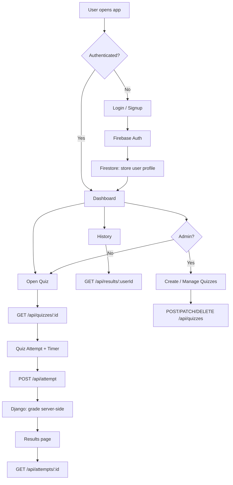
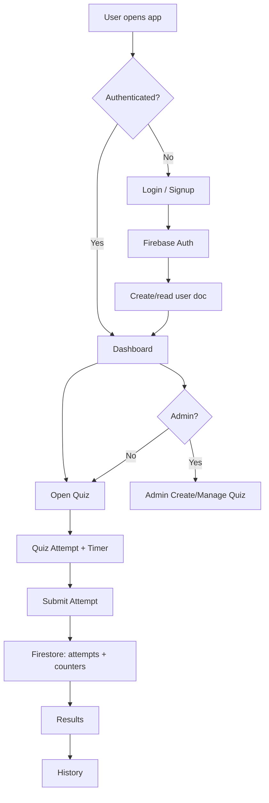

# Quiz Portal

Quiz Portal is a web app where users can sign in with Google, attempt timed quizzes, view detailed results with answer review, and track attempt history. Admin users can create and manage quizzes.

**Live app:** https://t1-mrinmoy-patra.vercel.app

**Repository:** https://github.com/Mrinmoypatratint/T1-Mrinmoy-Patra

---

## Stack

| Layer | Technology |
|---|---|
| Frontend | React 18 + TypeScript + Vite + TailwindCSS + React Query |
| Auth (BaaS) | Firebase Auth (Google OAuth + Email/Password) |
| User data | Cloud Firestore (user profiles + role) |
| Quiz/Attempt API | Django 6 + Django REST Framework + SQLite |
| Hosting | Vercel (frontend) |

---

## Architecture

```text
Browser (React SPA)
  ├─ Firebase Auth → Google / Email login, session persistence
  ├─ Cloud Firestore → user profile storage (name, email, role)
  └─ Django REST API → all quiz & attempt data
        ├─ Validates Firebase ID token on every request
        ├─ Stores quizzes, questions, attempts in SQLite
        └─ Calculates score server-side (correct answers never sent to client)
```

---

## API Endpoints

| Method | Path | Description |
|---|---|---|
| `GET` | `/api/me` | Get or create authenticated user profile |
| `GET` | `/api/quizzes` | List published quizzes |
| `POST` | `/api/quizzes` | Create quiz (admin only) |
| `GET` | `/api/quizzes/:id` | Quiz detail with questions (no correct answers) |
| `PATCH` | `/api/quizzes/:id` | Update quiz metadata (admin only) |
| `DELETE` | `/api/quizzes/:id` | Delete quiz (admin only) |
| `GET` | `/api/quizzes/:id/my-attempt` | Check if authenticated user has attempted this quiz |
| `POST` | `/api/attempt` | Submit attempt — score calculated server-side |
| `GET` | `/api/results/:userId` | User attempt history |
| `GET` | `/api/attempts/:id` | Single attempt detail with answer review |
| `GET` | `/api/admin/quizzes` | All quizzes including unpublished (admin only) |
| `GET` | `/api/health` | Health check |

All endpoints require `Authorization: Bearer <Firebase ID Token>`.

---

## Application Flow (Mermaid)



---

## Project Structure

```text
Quiz/
├── apps/
│   ├── frontend/
│   │   ├── src/
│   │   │   ├── api/hooks.ts          ← all API calls to Django backend
│   │   │   ├── components/
│   │   │   ├── context/AuthContext.tsx
│   │   │   ├── pages/
│   │   │   ├── firebase.ts
│   │   │   ├── types.ts
│   │   │   └── App.tsx
│   │   ├── firestore.rules
│   │   ├── firestore.indexes.json
│   │   ├── vercel.json
│   │   └── package.json
│   └── backend/
│       ├── manage.py
│       ├── requirements.txt
│       ├── quiz_project/
│       │   ├── settings.py
│       │   └── urls.py
│       └── quizzes/
│           ├── models.py             ← AppUser, Quiz, Question, Attempt
│           ├── views.py              ← all API views
│           ├── authentication.py     ← Firebase token validation
│           └── urls.py
├── screens/                          ← UI wireframes
├── DEPLOYMENT.md
├── DOCUMENTATION_for Quiz.md
└── README.md
```

---

## Local Setup

### Prerequisites

- Node.js >= 18
- Python >= 3.11
- Firebase project with Auth + Firestore enabled

### 1) Frontend env

Create `apps/frontend/.env`:

```env
VITE_FIREBASE_API_KEY=your-api-key
VITE_FIREBASE_AUTH_DOMAIN=your-project.firebaseapp.com
VITE_FIREBASE_PROJECT_ID=your-project-id
VITE_FIREBASE_STORAGE_BUCKET=your-project.firebasestorage.app
VITE_FIREBASE_MESSAGING_SENDER_ID=123456789
VITE_FIREBASE_APP_ID=1:123456789:web:abcdef
VITE_ADMIN_EMAILS=admin@example.com
VITE_API_URL=http://localhost:8000
```

### 2) Backend env

Create `apps/backend/.env` (or export these variables):

```env
FIREBASE_API_KEY=<same value as VITE_FIREBASE_API_KEY>
ADMIN_EMAILS=admin@example.com
DJANGO_SECRET_KEY=change-me-in-production
ALLOWED_HOSTS=localhost,127.0.0.1
CORS_ALLOWED_ORIGINS=http://localhost:5173,http://localhost:5174
```

### 3) Run backend

```bash
cd apps/backend
pip install -r requirements.txt
python manage.py migrate
python manage.py runserver 0.0.0.0:8000
```

Health check: `http://localhost:8000/api/health`

### 4) Run frontend

```bash
cd apps/frontend
npm install
npm run dev
```

Open the URL shown by Vite (usually `http://localhost:5173`).

---

## UI Screens

Wireframe-style screen references are included in `screens/`. See `screens/README.md` for index.

---

## Firestore Data Model

Firestore is used only for **user profiles** (Auth integration):

- `users/{uid}` → `{ name, email, photoUrl, role, createdAt }`

Quiz, question, and attempt data live in the Django SQLite database.

---

## Security Notes

- Firebase ID token is validated on **every API request** by the Django backend using the Firebase REST API.
- **Correct answers are never sent to the client** — `correctAnswerIndex` is omitted from the GET quiz detail response.
- Score is **calculated server-side** in `POST /api/attempt`.
- Admin role is determined server-side from the `ADMIN_EMAILS` env var — not from client claims.
- Firestore Security Rules are version-controlled in `apps/frontend/firestore.rules` (not test mode).

---

## Deployment

See **[DEPLOYMENT.md](./DEPLOYMENT.md)** for production steps.

---

## Assumptions / Trade-offs

- Firebase Auth is the single source of user identity; the Django backend syncs user info on first API call.
- SQLite is used for the backend DB — suitable for a single-server deployment. Swap for PostgreSQL for production scale.
- Admin role is email-based (hardcoded list via env var) as specified in the requirements.
- The Firestore user collection remains for Auth-context integration; all other data is in SQLite.

---

## Compliance Checklist

| Requirement | Status | Evidence |
|---|---|---|
| Public GitHub repo with history | ✅ | Repository link above |
| README with setup/env/overview/trade-offs | ✅ | This file |
| Deployment guide | ✅ | `DEPLOYMENT.md` |
| Technical documentation | ✅ | `DOCUMENTATION_for Quiz.md` |
| Flow chart (Mermaid) | ✅ | Embedded above |
| `/screens` folder included | ✅ | `screens/` |
| BaaS for auth | ✅ | Firebase Auth (Google OAuth) |
| Firestore security rules | ✅ | `apps/frontend/firestore.rules` |
| Firestore indexes | ✅ | `apps/frontend/firestore.indexes.json` |
| Google token validation (server-side) | ✅ | `quizzes/authentication.py` |
| Score calculated server-side | ✅ | `POST /api/attempt` in `quizzes/views.py` |
| 5 required API endpoints | ✅ | Listed in API Endpoints table above |
| Correct answers never exposed to client | ✅ | GET quiz detail omits `correctAnswerIndex` |
| Admin role system | ✅ | Email-based, enforced server-side |
| Production deployment | ✅ | Live URL above |


---

## Stack

- **Frontend:** React 18 + TypeScript + Vite + TailwindCSS + React Query
- **Backend (production data/auth):** Firebase Auth + Cloud Firestore
- **Backend (optional local service):** Minimal Django (`/` + `/api/health`)
- **Hosting:** Vercel (frontend)

---

## Current Architecture

```text
Browser (React app)
  ├─ Firebase Auth (Google + Email/Password)
  └─ Cloud Firestore (users, quizzes, questions, attempts)

Optional local Django backend (apps/backend)
  ├─ GET /
  └─ GET /api/health
```

> Important: quiz data flow in the app is Firebase-first. The Django backend is intentionally minimal and optional.

---

## Application Flow (Mermaid)



---

## Project Structure

```text
Quiz/
├── apps/
│   ├── frontend/
│   │   ├── src/
│   │   │   ├── api/hooks.ts
│   │   │   ├── components/
│   │   │   ├── context/AuthContext.tsx
│   │   │   ├── pages/
│   │   │   ├── firebase.ts
│   │   │   ├── types.ts
│   │   │   ├── App.tsx
│   │   │   └── main.tsx
│   │   ├── firestore.rules
│   │   ├── firestore.indexes.json
│   │   ├── vercel.json
│   │   └── package.json
│   └── backend/
│       ├── manage.py
│       ├── requirements.txt
│       └── quiz_project/
│           ├── settings.py
│           ├── urls.py
│           ├── views.py
│           ├── asgi.py
│           └── wsgi.py
├── DEPLOYMENT.md
├── DOCUMENTATION_for Quiz.md
├── screens/
└── README.md
```

---

## Local Setup

### Prerequisites

- Node.js >= 18
- Python >= 3.11 (project uses local venv at `d:/Projects/Quiz/.venv`)
- Firebase project with Auth + Firestore enabled

### 1) Frontend env

Create `apps/frontend/.env`:

```env
VITE_FIREBASE_API_KEY=your-api-key
VITE_FIREBASE_AUTH_DOMAIN=your-project.firebaseapp.com
VITE_FIREBASE_PROJECT_ID=your-project-id
VITE_FIREBASE_STORAGE_BUCKET=your-project.firebasestorage.app
VITE_FIREBASE_MESSAGING_SENDER_ID=123456789
VITE_FIREBASE_APP_ID=1:123456789:web:abcdef
VITE_ADMIN_EMAILS=admin@example.com
```

### 2) Run frontend

```bash
cd apps/frontend
npm install
npm run dev
```

Open the URL shown by Vite (usually `http://localhost:5173` or `:5174`).

### 3) Run optional Django backend

```bash
cd apps/backend
d:/Projects/Quiz/.venv/Scripts/python.exe manage.py migrate
d:/Projects/Quiz/.venv/Scripts/python.exe manage.py runserver 0.0.0.0:8000
```

Health check:

- `http://localhost:8000/api/health`

---

## UI Screens Submission

All UI screens are included in the repository under:

- `screens/`

Files are clearly named by page/flow and include lightweight wireframe-style references.

---

## Firestore Data Model (high-level)

- `users/{uid}` → profile + role (`USER` / `ADMIN`)
- `quizzes/{quizId}` → metadata
- `quizzes/{quizId}/questions/{questionId}` → question docs
- `attempts/{attemptId}` → quiz submissions + score + review

---

## Security Notes

- Firebase config values in frontend are expected to be public.
- Real protection is enforced by **Firestore Security Rules**.
- Admin behavior is driven by `VITE_ADMIN_EMAILS` + user role checks.
- Firestore rules are version-controlled in `apps/frontend/firestore.rules` (not test mode).
- Firestore composite indexes are version-controlled in `apps/frontend/firestore.indexes.json`.

---

## Deployment

See **[DEPLOYMENT.md](./DEPLOYMENT.md)** for exact production steps.

---

## Assumptions / Trade-offs

- Primary runtime backend is Firebase (BaaS); Django backend is intentionally minimal and optional.
- Client-side quiz scoring is kept for simplicity/cost (Spark plan friendliness).
- UI screens in `/screens` are practical wireframe-style artifacts for evaluation traceability.

---

## Compliance Checklist (Evaluation-Oriented)

| Requirement | Status | Evidence |
|---|---|---|
| Public GitHub repo with history | ✅ | Repository link above |
| README with setup/env/overview/trade-offs | ✅ | This file |
| Deployment guide | ✅ | `DEPLOYMENT.md` |
| Technical documentation | ✅ | `DOCUMENTATION_for Quiz.md` |
| Flow chart (Mermaid) | ✅ | Embedded section above |
| `/screens` folder included | ✅ | `screens/` |
| BaaS backend used | ✅ | Firebase Auth + Firestore |
| Firestore security rules included | ✅ | `apps/frontend/firestore.rules` |
| Firestore indexes included | ✅ | `apps/frontend/firestore.indexes.json` |
| Production deployment available | ✅ | Live URL above |

> Note: `storage.rules` is not included because this project does not currently use Firebase Storage uploads.

---

## Status Snapshot

- Frontend: active and deployed on Vercel
- Firebase: primary runtime backend for app features
- Django backend: intentionally simplified for optional local use
